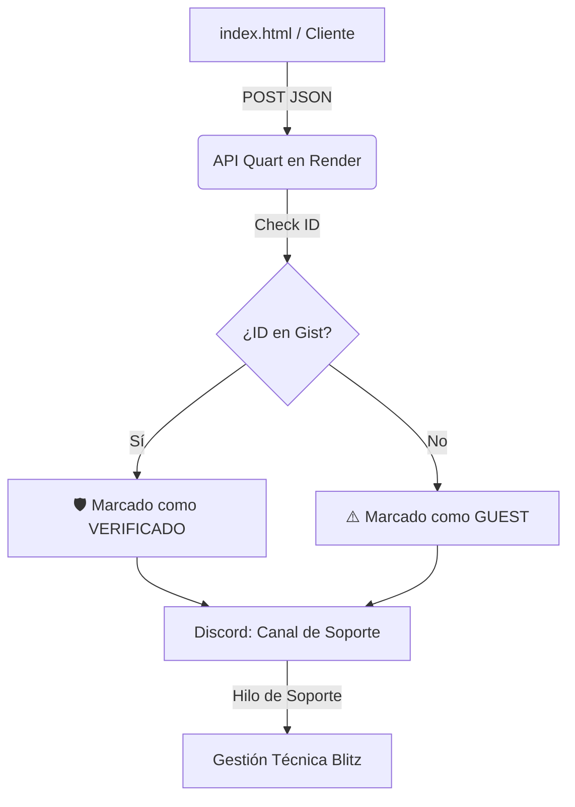

## ⚡ Blitz Support Hub

 

**Blitz Support Hub** es un ecosistema de soporte técnico que une la agilidad de un **Frontend moderno** con la potencia de **Discord** como centro de operaciones.

## 📐 Arquitectura del Sistema

## 🛠️ Stack Tecnológico
- **Bot Engine:** Discord.py (Cogs Architecture)
- **API Gateway:** Quart (Asynchronous Flask-like API)
- **Server:** Hypercorn (ASGI for Python 3.14)
- **Frontend:** Tailwind CSS & HTML5 (Blitz Speed optimized)

## 🏗️ Características principales
- ✅ **Generación de IDs:** Sistema automático de IDs de contrato para clientes.
- ✅ **Bridge API:** Los tickets de la web viajan de forma segura a Discord sin exponer Webhooks.
- ✅ **Multitasking:** Servidor web y Bot de Discord corriendo en hilos paralelos.
- ✅ **Soporte L1:** Clasificación de incidencias por impacto y urgencia.
- 
---
Desarrollado por [Alejandro Tineo Morales/Blitz IT] – *Built for Scale.*
