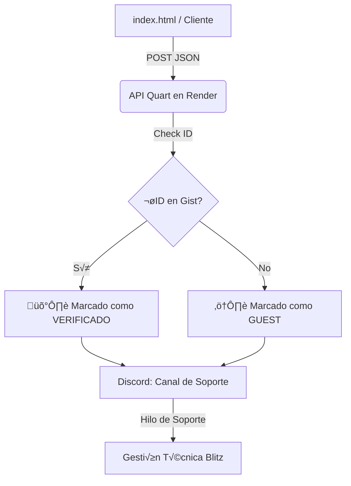

```mermaid
graph TD
    A[index.html / Cliente] -->|POST JSON| B(API Quart en Render)
    B -->|Check ID| C{¬øID en Gist?}
    C -->|Sí| D[🛡️ Marcado como VERIFICADO]
    C -->|No| E[⚠️ Marcado como GUEST]
    D --> F[Discord: Canal de Soporte]
    E --> F
    F -->|Hilo de Soporte| G[Gestión Técnica Blitz]
```
